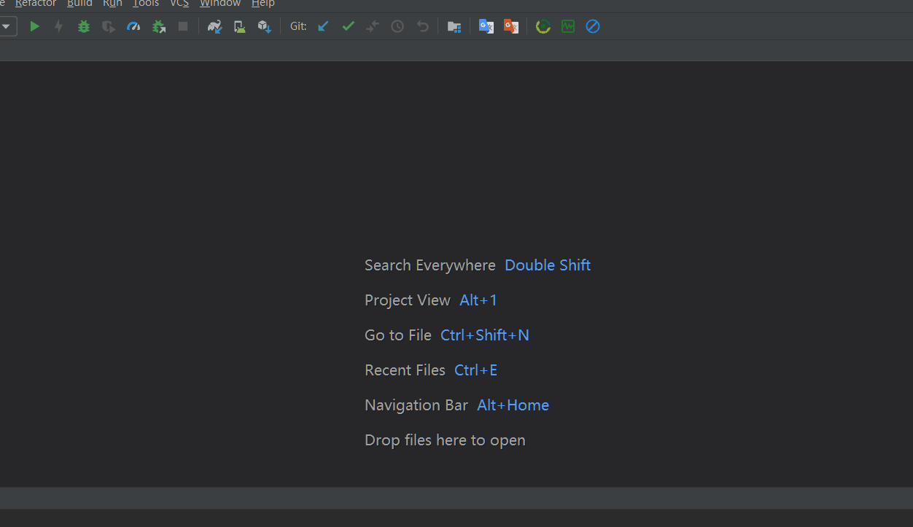
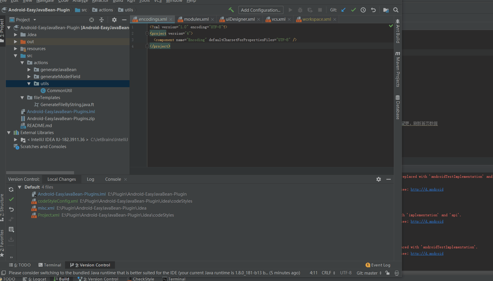
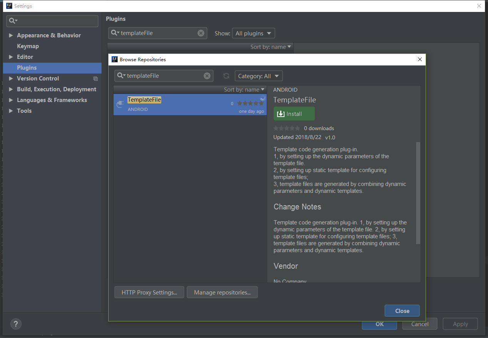
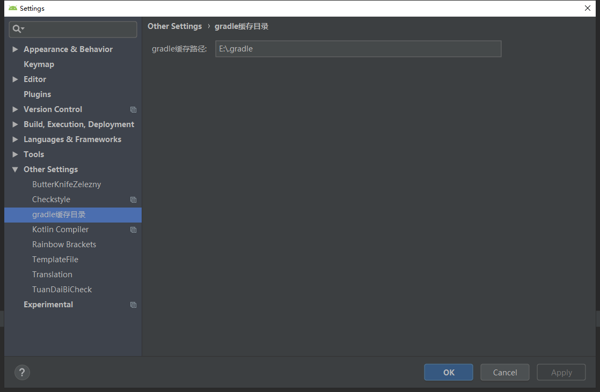
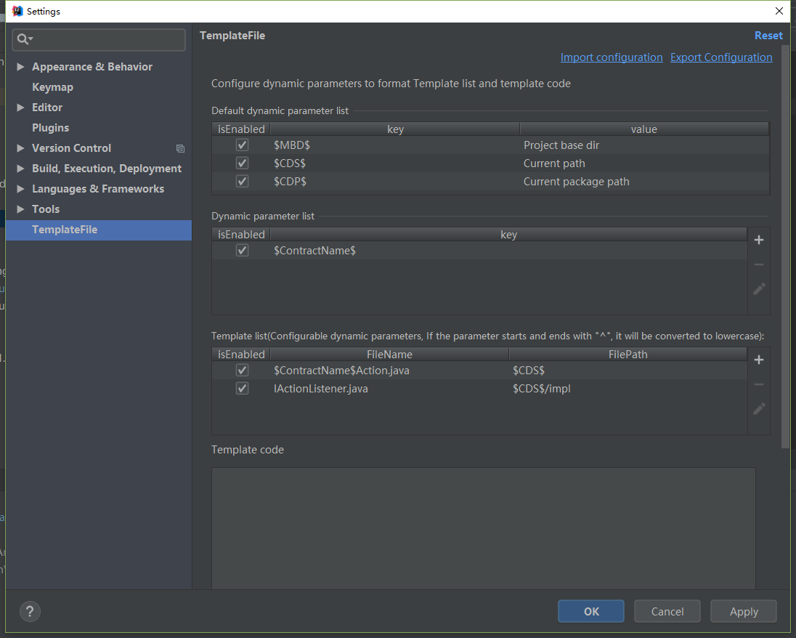

# TemplateFile

## 1.0.2更新内容:
新增了gradle缓存清除功能，达到强制重新下载gradle依赖的问题

## 演示
Gradle缓存清除

模板文件自动生成

## 说明
- 本插件可以自动生成一些有规律的模板文本文件
- 本插件可以清除Gradle缓存

## 下载插件    
1. 打开IDEA，搜索插件templateFile，并安装；
 或者直接下载到本地[templateFile](https://raw.githubusercontent.com/alfredxl/TemplateFile/master/TemplateFile.zip)，再使用IDEA导入插件  

      

## Gradle缓存清除用法  
1. 打开配置，配置gradle缓存目录，如下图：
 
   

2. 点击工具栏的按钮，搜索你要清除的依赖，点击清除，最后点击gradle的同步按钮即可，详见上述演示

## 模板文件用法     
1. 打开配置，配置动态参数，以及模板信息，如下图：    

   

2. 也可通过上方的导入配置选项，导入配置，并保存;    

[示例配置模板(保存到文本文件)](config/templateConfiguration.txt)

3. 按照上述示例，即可使用.    

4. [详细使用文档](https://blog.csdn.net/vv765947965/article/details/82109676)

